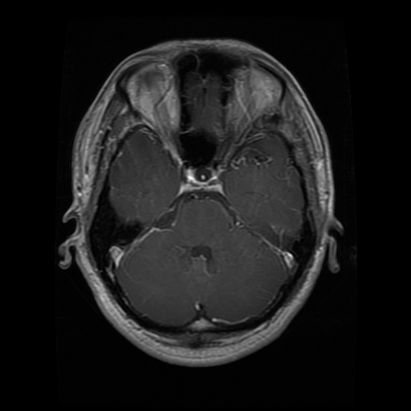

# 🧠 Brain Tumor Classification with Convolutional Neural Networks (CNNs)



**Author:** Álvaro Juan Travieso García  
**Date:** October 25, 2023

---

## 📖 Project Summary

This project focuses on classifying **brain tumor images** using **Convolutional Neural Networks (CNNs)**. The dataset includes three tumor types: **Glioma**, **Meningioma**, and **Pituitary Tumor**. A CNN model was trained, and experiments were conducted to evaluate performance using various evaluation strategies. 🚀

---

## ✨ Features & Highlights

- 🖼️ **Dataset**: Images of three types of brain tumors.
- 🧠 **CNN Models**: Implementation of **ResNet**, **DenseNet**, and a **custom CNN**.
- 🎯 **High Accuracy**: DenseNet achieved the highest test accuracy (93.81%).
- 🔄 **Model Ensemble**: Combines predictions from multiple models using majority voting to improve classification performance.
- 📊 **Experimentation**: Includes careful dataset splitting, data transformations, batch processing, and training strategies.

---

## 📂 Project Structure

```plaintext
├── DatasetTumoresCerebrales/   # Brain tumor images dataset
├── ResNet_model.py             # ResNet implementation
├── DenseNet_model.py           # DenseNet implementation
├── CustomCNN_model.py          # Custom CNN implementation
├── train.py                    # Training script
├── test.py                     # Evaluation script
└── README.md                   # Project documentation
```

---

## ⚙️ Training & Evaluation

- **Loss Function**: Cross-entropy loss for multi-class classification.
- **Optimizer**: Adam (learning rate = 0.001)
- **Epochs**: 20
- **Batch Size**: 32
- **Early Stopping**: Monitors test accuracy to prevent overfitting.

---

## 📈 Experiment & Results

### Model Ensemble

- Combines ResNet, DenseNet, and Custom CNN outputs.
- Uses **majority voting** to determine final prediction.
- Achieved **>92.51% test accuracy**, improving over individual models.
- Demonstrates the effectiveness of ensemble methods for reliable brain tumor classification.

---

## 💡 Discussion

- Ensemble models leverage strengths of individual architectures.  
- Improves accuracy and robustness in brain tumor classification.  
- Critical for **early detection** and **accurate diagnosis** in clinical settings.

---

## 🚀 Conclusions & Future Work

- CNNs are highly effective for brain tumor image classification.  
- Promising results suggest applicability in real-world clinical scenarios.  

### Future Directions

- Explore advanced **data augmentation** for medical imaging.  
- Enhance **model interpretability** to understand key features driving predictions.  
- Expand datasets and classify **subtypes of brain tumors** for clinical relevance.

---

## 📚 References

1. He, K., Zhang, X., Ren, S., & Sun, J. (2016). Deep Residual Learning for Image Recognition. *CVPR*, 770-778.  
2. Huang, G., Liu, Z., Van Der Maaten, L., & Weinberger, K. Q. (2017). Densely Connected Convolutional Networks. *CVPR*, 4700-4708.  
3. Kingma, D. P., & Ba, J. (2014). Adam: A Method for Stochastic Optimization. *arXiv preprint arXiv:1412.6980*.
